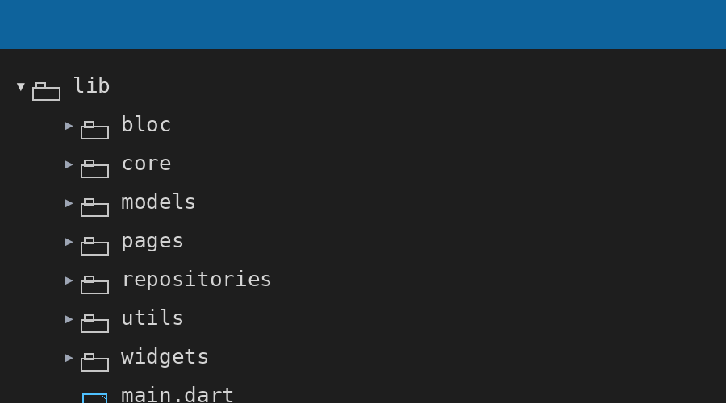
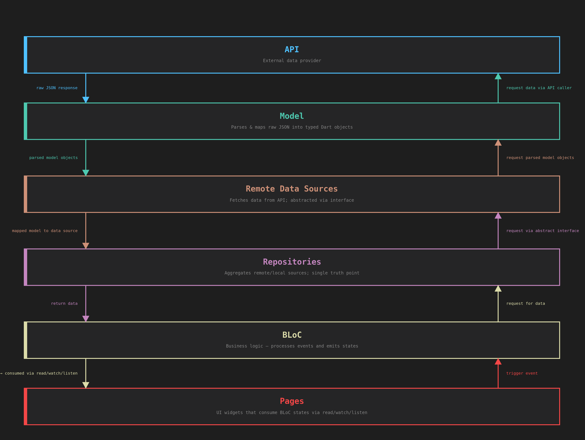
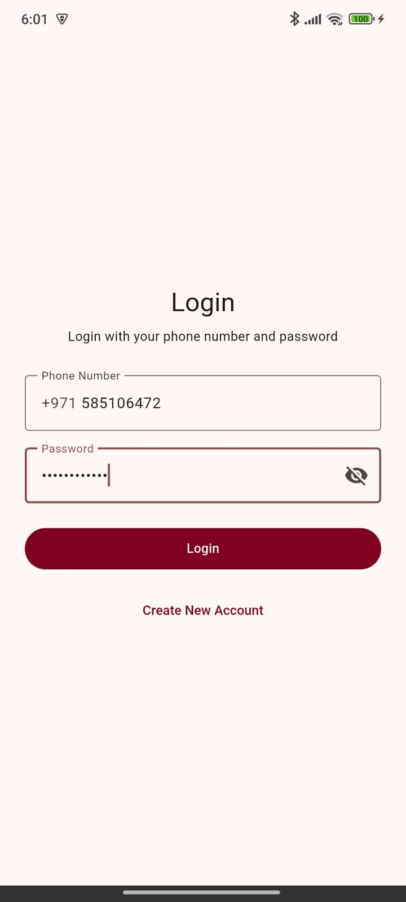
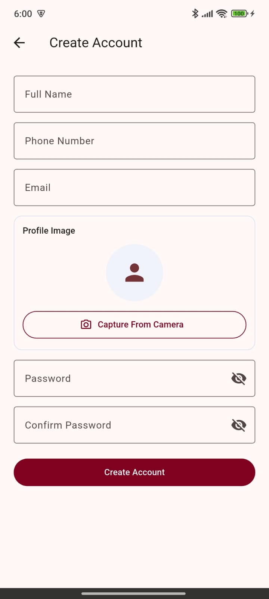
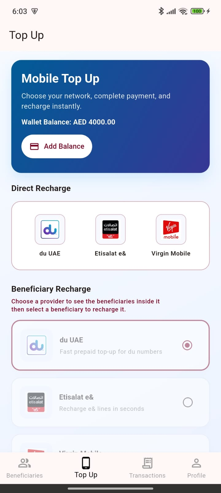
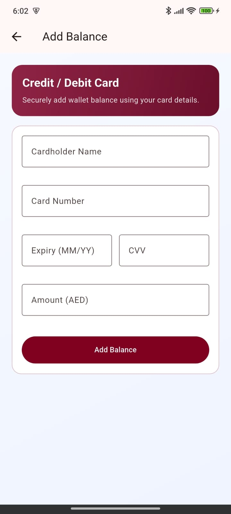
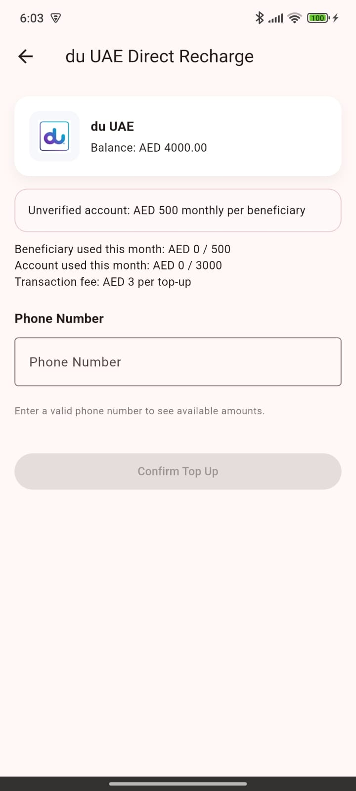
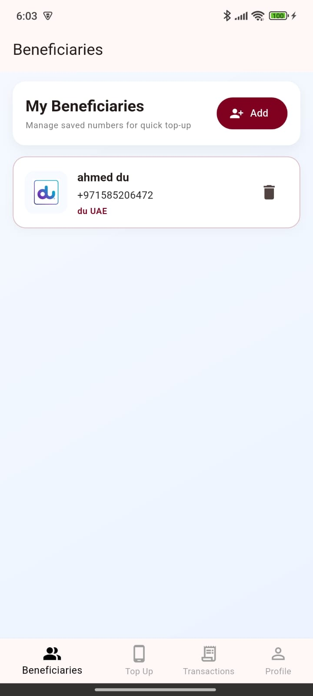

# Finance House Assessment

### Name: Ahmed Kubur
### Email: ahmed.i.kubur@gmail.com

### App download page:
If you would like to try the application go to this page to download the latest release: https://github.com/ahmedkubur/assessment_finance_house/releases/tag/0.0.1

### Introduction
In this app I'm using Bloc for state management, Dio for networking, Mocktail for testing.

I also utilized a range of design patterns and clean code architecture practices, including the Repository Pattern, Inversion of Control, and Programming to an Interface. These practices will enable us to adhere to multiple SOLID principles, ensuring the codebase remains maintainable and testable.

### Application Overview
This application was developed to showcase my strong UI/UX skills and overall mobile development capabilities. It demonstrates a complete user journey, starting from account creation through login and in-app usage.

The app uses a mock API that stores user data in a local database. Please note that if the app is uninstalled, all user data will be permanently deleted. 

Kindly keep the app installed to retain your data.

Wallet & Balance System:

Each user is assigned a wallet with a maximum monthly balance limit of AED 5,000.
- The wallet can be used for:
Direct Top-Up by selecting a service provider entering the phone number entering the desired amount.
Top-Up to a Beneficiary by selecting a service provider choosing a saved beneficiary and entering the desired amount

User Account Highlighted Features:

The users can change their password.
Update their profile picture.
View a transaction history screen to clearly understand all performed actions.

Verification (Spoof) Functionality:

The app includes a simulated verification feature.
- This functionality is intentionally mocked and does not perform real verification. It is designed to demonstrate:
How the app behaves when a user is not verified.
How the experience changes after verification.

- Once verified (in the simulated flow), users gain:
The ability to add beneficiaries.
Expanded top-up capabilities.

### Project Directory
Organizing files and folders based on features greatly enhances the ability to locate related components in your application. Here’s a breakdown of our folder structure:

- Core: This section houses essential classes that are fundamental to the entire application, such as api_service.dart for real api calling handling all types of errors and also the api folder for mock apis and the db folder using sqflite for the current app database.
- Models: Here, we store models that should be accessible throughout the entire app, like the user model local models and error models.
- Repositories: The Repositories directory is home to repositories that are crucial for the functioning of the entire application, such as Auth.
- Widgets: In this directory, I gather reusable widgets that can be utilized throughout the entire app.
- Bloc: This section houses the logic and state management components using bloc cubit for this current application.
- Utils: contains extra code like helper functions for example, or input validator class.
- Pages: Each page within the app is organized as a separate folder, and within each folder two files, you will find its corresponding data file and the page file itself. I use relative path imports to ensure screens are as reusable as possible.

By structuring the project in this manner, you can promote modularity, making it easier to develop and test your application.




### Data Flow Diagram




### Clean Architecture
As shown in the diagram above, I'm adopting a clear separation of concerns by segregating the View logic, Business logic, and Data access logic.

To illustrate this concept further, let’s consider an example: Suppose we have a bloc that uses an API call to retrieve data from a particular resource. In this scenario, we will execute the API call from the Repository that is specifically responsible for managing that resource.

This approach ensures that each part of our application has a well-defined responsibility:

- View Logic: This layer is responsible for managing the user interface and presentation. It interacts with bloc and displays data to the user.
- Business Logic: The business logic layer contains the application’s core logic. It coordinates actions, transformations, and operations needed to fulfill user requests. This layer works with the data access layer through abstract interfaces, maintaining separation.
- Data Access Logic: This layer, represented by repositories, handles the actual data retrieval and storage operations. By programming to interfaces, we can easily swap out different data sources (e.g., APIs, databases, or local storage) without affecting the higher-level logic.


Here are some screenshots from the app








### Installation

1. **Clone the repository**:

   ```bash
   git clone https://github.com/ahmedkubur/assessment_finance_house.git
   cd assessment
   ```

2. **Install dependencies**:

   ```bash
   flutter pub get
   ```

3. **Run the application**:

   ```bash
   flutter run
   ```

### Testing

**Run tests**:

1 - Run this command to get clear and organized results

  ```bash
   ./run_tests.sh 
  ```
2 - Or run all test together with this command below
  ```bash
   flutter test
  ```

